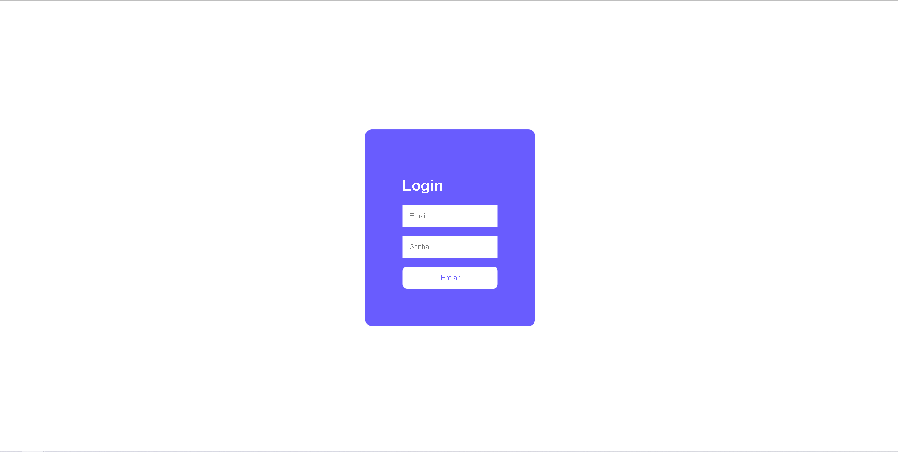
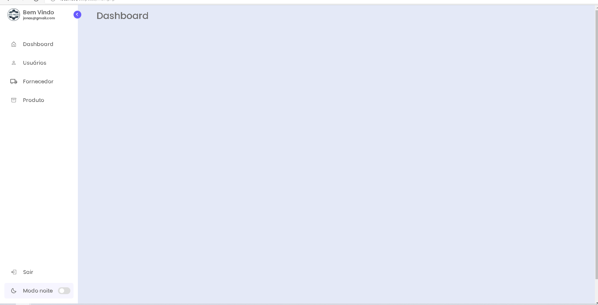
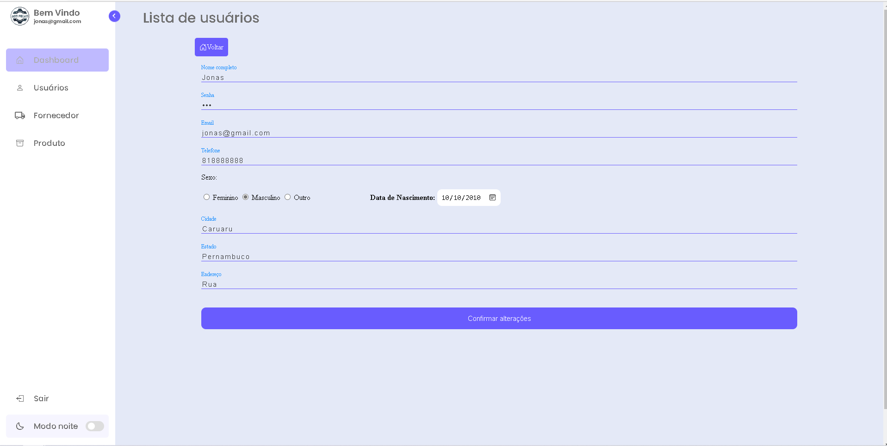
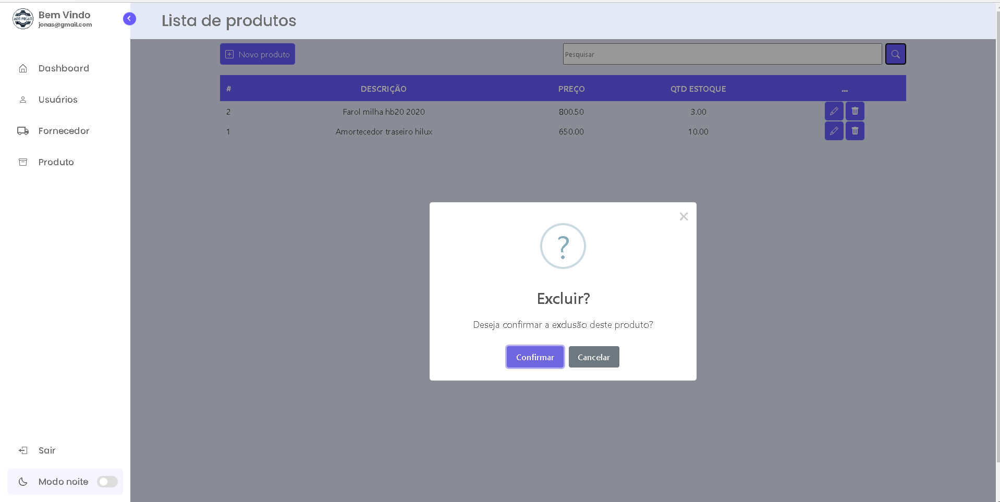
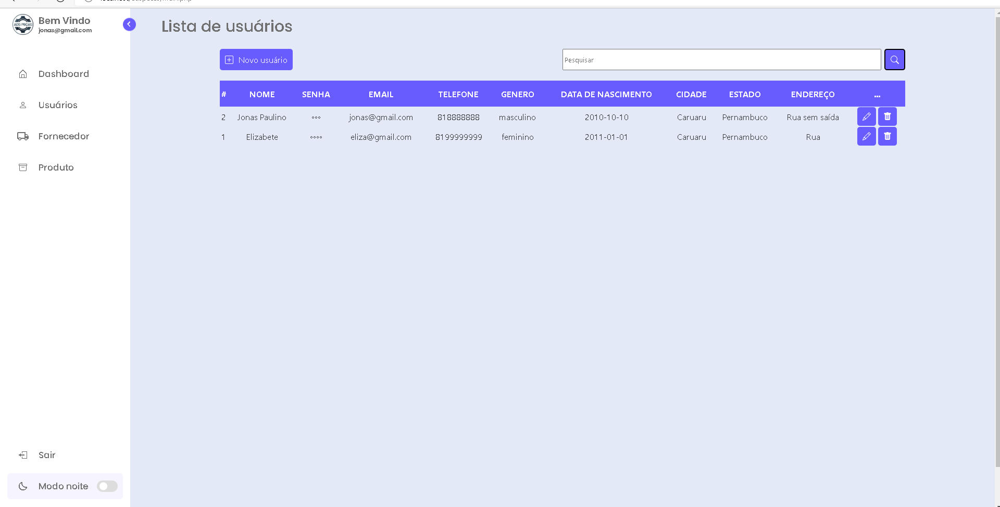
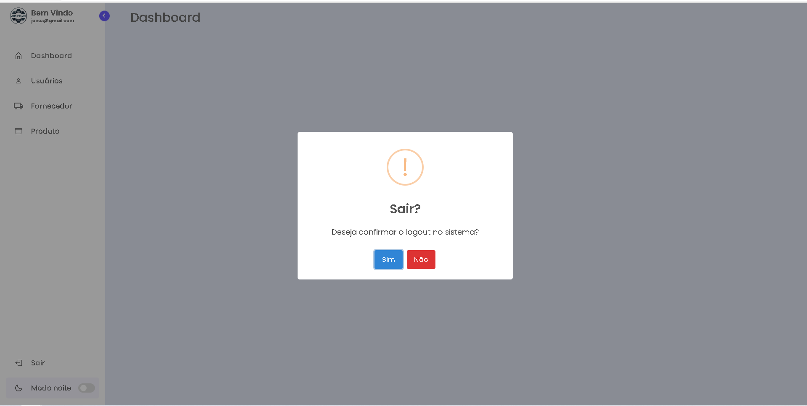

👋 Olá tudo bem? Sou Jonas Paulino, o professor solicitou um sistema de crud com backend em php, criei o crud e algumas coisinhas a mais 🤣🤣..

✅ Tela de login  
✅ Menu Vertical  
✅ Paginação usando iframe  
✅ Menssageiro sweetalert2  
✅ Modo noturno  
✅ Validação de sessão   

<h1>Algumas imagens do projeto</h1>
<h3>Tela de login</h3>
  
<h3>Tela principal</h3>
  
<h3>Tela de cadastro de um usuário</h3>
 
<h3>Mensagem de delete em uma tabela</h3>
 
<h3>Listagem de usuários</h3>
 
<h3>Mensagem de logout</h3>

 
<h1>Baixe e divirta-se</h1>

Não foi utilizado POO nem MVC neste projeto
